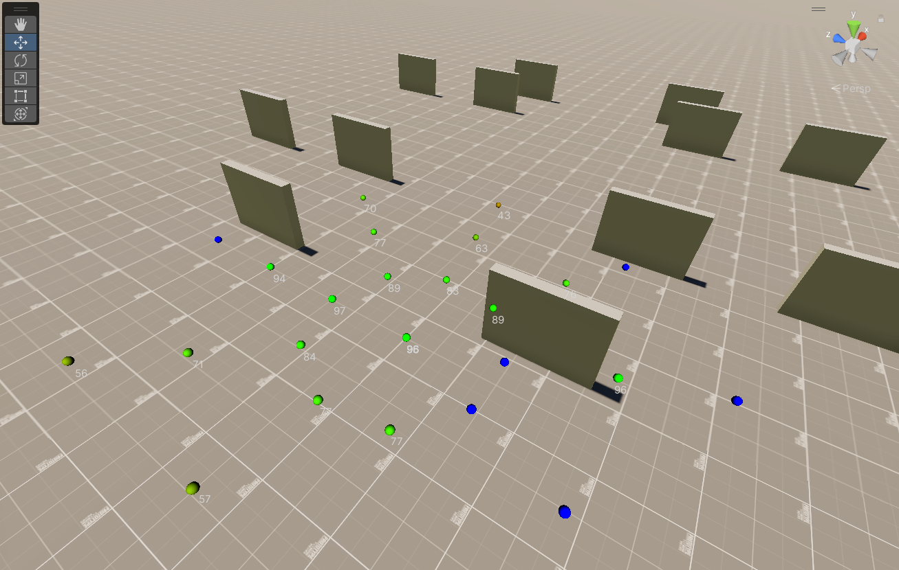

# SimpleAI
Coroutine-based utility AI for [Unity3d](https://unity3d.com). Includes an Unreal inspired perception and environment query system.

Requires [GameCore](https://github.com/MKSQD/GameCore) (not a packet yet because the author is lazy AF).

This repo is relatively stable and production ready.

## Overview
This library is a framework for AI and does not contain any behaviour. The API surface is minimal and you should be up and running in no time.

Every AIAgent has a set of possible Actions and at most one coroutine. Which Action is executed is choosen by utility functions. The Action is started by running its coroutine. Actions can be interrupted if there's an Action with a significantly higher utilitity. When iterrupted the coroutine is stopped and a virtual function on the Action is called to cleanup.

Compared to state-of-the-art behaviour trees this solution is as lightweight as it gets. As simple and cheap as a FSM but modular, extensible and comfy to write code for. There's no editor to learn, everything is boring old ScriptableObjects and plain classes. On the other hand it's harder to balance as Actions are chosen by fuzzy scores instead of rigid if-then rules. Out of the box designers can only tweak when actions are chosen/interrupted and tweak action parameters, nothing more.

Note that the AI does not plan in any way. It is purely reactionary. _I'm being shot so I'm in combat now. I'm almost dead so I'm running away now._ If you need planning look into GOAP or the more modern HTN.

There's support for multiple types of AI (Intelligences - soldiers, zombies, animals, ...) in the same project. There's a simple EQS system to search for good positions based on utility functions.

_If it's this simple why wouldn't I want to do this myself?_ Well big chief, this library is as minimal as it gets. So there's no bloat or features you won't use. The logic is simple and not spectacular yet the details matter. There's  tooling which is important as the biggest gripe with the this AI is the scoring and why an Action was chosen/interrupted.

_Well if utility based scoring is hard to balance why not use a tree, for say, behaviour?_ Because it's easy to extend and tweak. No need to think about rules, just give the AI some context, Actions and considerations/checks and watch it go. Everything can be tweaked at runtime and there's a runtime debugger to see why an Action was chosen. Actions themselves can be as simple or complex as required. From a simple goto, animate, SmartObject to a cutscene written in plain C#.


```cs
// A context contains all the data that's relevant for the AI to run.
// This is an AIs "view" of the world. You could process all the things
// ad-hoc every time a new Action is considered/the AI is ticked but
// you don't want to do that mainly for performance reasons. That's
// why we want an "IsArmed" here instead of accessing the Actor, then
// it's Inventory and looking through the item List.
public class ActorAIContext : IContext {
    public MonoBehaviour CoroutineTarget => Actor;

    /// The Pawn this AIAgent controls
    public Actor Actor;

    public Actor BestTarget;
    public SmartObjectBase BestSmartObject;
    public SmartObjectBase CurrentSmartObject;

    public bool IsArmed = false;

    // The next 2 methods are required for the inspector to display "considerations" for an action
    public float GetCurrentConsiderationScore(int considerationIdx)
        => considerationIdx switch {
            0 => 1,
            1 => BestTarget != null ? 1 : 0,
            2 => IsArmed ? 1 : 0,
            _ => throw new Exception("case missing")
        };

    public string[] GetConsiderationDescriptions() 
        => new string[] {
            "Constant",
            "Has Target",
            "Is Armed",
        };
}

// Your "enemy" component. This owns and updates both the context and the AIAgent.
public class Actor : MonoBehaviour {
    // The "type" of AI to use (zombie, soldier, ...)
    public Intelligence Intelligence;

    ActorAIContext ctx;
    AIAgent<ActorAIContext> ai;

    float nextContextUpdateTime;
    float nextAttackTime;

    void Start() {
        ctx = new ActorAIContext() { Actor = this };
        ai = new AIAgent<ActorAIContext>(Intelligence);
    }

    public override void Update() {
        if (Time.time >= nextContextUpdateTime) {
            nextContextUpdateTime = Time.time + 0.1f;
            
            // Getters, raycasts, Physics.OverlapSphereNonAlloc, etc. to fill the context
            // with valuable information
            ctx.BestTarget = ...;
            ctx.BestSmartObject = ai.SelectSmartObject(ctx, ctx.SmartObjects);
            ctx.IsArmed = ...;
        }

        ai.Tick(ctx);
    }

    void Attack() {
        if(Time.time < nextAttackTime)
            return;

        nextAttackTime = Time.time + 1;
        Debug.Log($"Attacking {ctx.BestTarget}");
    }
}

// One example "Action" the AI can do. Note that this needs to be in its own
// file because it's a ScriptableObject.
[CreateAssetMenu(menuName = "AI/Actor/Attack")]
public class AttackAction : Action<ActorAIContext> {
    public override IEnumerator StartAction(ActorAIContext ctx) {
        Debug.Log("Start attack");

        while (ctx.BestTarget != null) {
            ctx.Actor.Attack();
            yield return null;
        }

        Debug.Log("Done Attacking");
    }

    public override void StopAction(ActorAIContext ctx) {
        Debug.Log("Attack completed or was canceled");
    }

    public override bool CheckProceduralPreconditions(ActorAIContext ctx) {
        return ctx.BestTarget != null;
    }
}
```

## Debugging


Under _SimpleAI/AIAgent Log_.

## SmartObjects
...are an AI inversion of control technique. Instead of an Action coroutine running for the AIAgent, there's a coroutine running inside the SmartObject (to be precise, there's still a "normal" Action running for the AI, but its passing all control to the SmartObject). This allows for object (chair, turret, public speech, patrol, fridge, ...) specific Actions (think The Sims).
 

```cs
// SmartObject is basically like an Action, but instead of being derived from ScriptableObject,
// it's derived from MonoBehaviour and can be slapped on a GameObject.
public class Patrol : SmartObject<ActorAIContext> {
    public Transform[] points;

    public override IEnumerator StartAction(ActorAIContext ctx) {
        for (int i = 0; i < points.Length; ++i) {
            var point = points[i];

            while (true) {
                var result = ctx.controller.WalkTo(point.position);
                if (result == AIController.MoveResult.Failed)
                    yield break;

                if (result == AIController.MoveResult.Arrived)
                    break;

                yield return null;
            }
        }
    }

    public override void StopAction(ActorAIContext ctx) {
    }

    void OnDrawGizmos() {
        if (points == null || points.Length == 0)
            return;

        var lastPoint = points[0];
        for (int i = 1; i < points.Length; ++i) {
            var point = points[i];
            Gizmos.color = Color.white;
            Gizmos.DrawLine(lastPoint.position, point.position);
        }
    }
}

// This class is NOT included in SimpleAI because it's specific to what's in your context.
// While this Action is running a corresponding coroutine is running inside the SmartObject.
[CreateAssetMenu(menuName = "AI/Actor/UseSmartObject")]
public class UseSmartObjectAction : Action<ActorAIContext> {
    public override IEnumerator StartAction(ActorAIContext ctx) {
        ctx.CurrentSmartObject = ctx.BestSmartObject;
        return ctx.CurrentSmartObject.StartAction(ctx); // The SmartObject coroutine is started here
    }

    public override void StopAction(ActorAIContext ctx) {
        ctx.CurrentSmartObject.StopAction(ctx);
    }

    public override bool CheckProceduralPreconditions(ActorAIContext ctx) {
        return ctx.BestSmartObject != null;
    }

    public override string ToString(IContext ctx) {
        if (((ActorAIContext)ctx).CurrentSmartObject != null) {
            return name + "/" + ((ActorAIContext)ctx).CurrentSmartObject.name;
        }
        return name;
    }
}
```

## Environment Query System




To test a query create a test agent under _SimpleAI/Create EQS Test Agent_ and set its Query attribute.

This is how you query for a position in code:
```cs
public class MoveAndFireAction : Action<ActorAIContext> {
    public QueryRunMode RunMode = QueryRunMode.Best;
    public Query Query;

    public override IEnumerator StartAction(ActorAIContext ctx) {
        // Give the EQS some context
        var queryCtx = new QueryRunContext() {
            Querier = ctx.Actor.transform.position,
            Target = ctx.TargetActorInfo.LastKnownLocation
        };

        Vector3 targetPosition;
        {
            // Run and wait for result
            var moveToPosition = Query.ExecuteAsync(RunMode, queryCtx);
            yield return moveToPosition.AsIEnumerator();

            if (moveToPosition.Result.Score < 0.01f)
                yield break; // No good position found

            targetPosition = moveToPosition.Result.Point;
        }

        // ...
    }
 }
```
